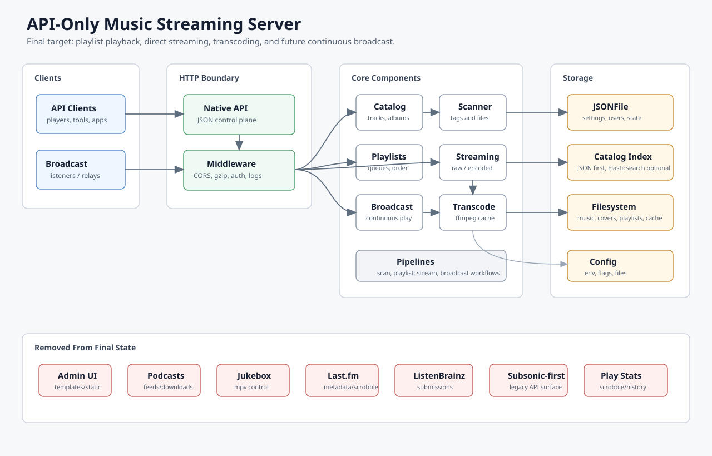
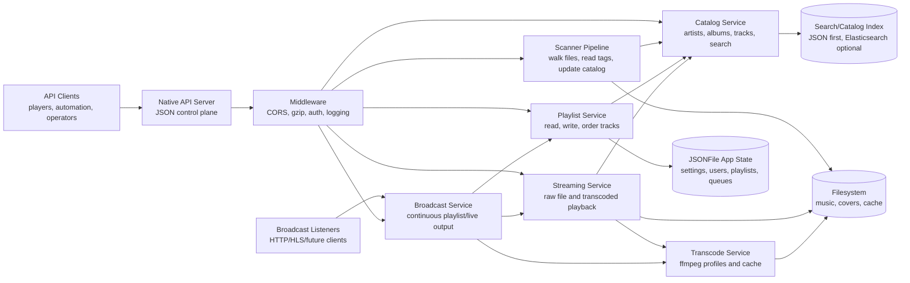
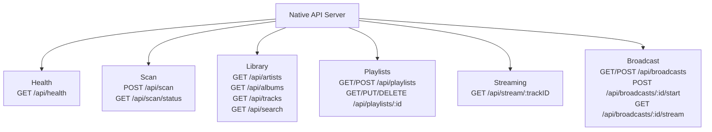
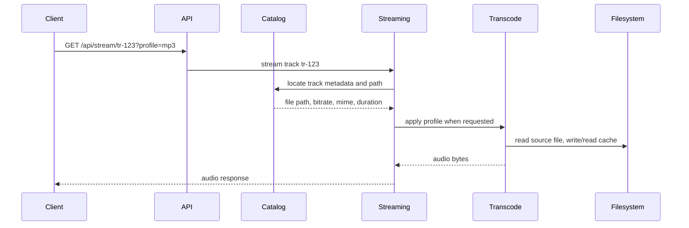
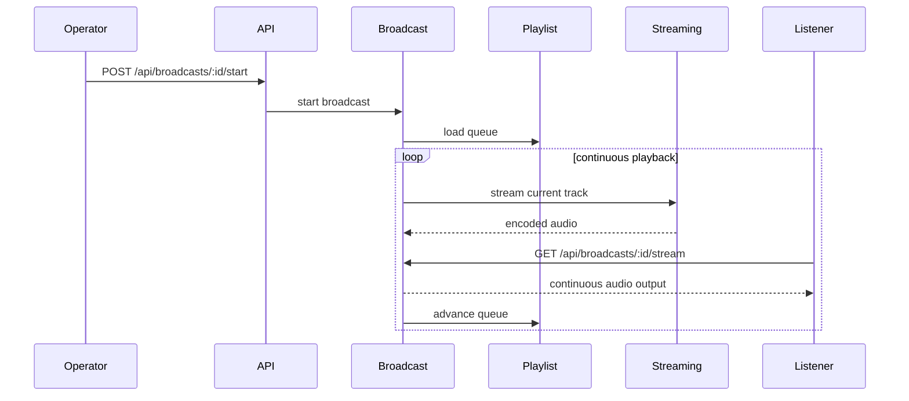
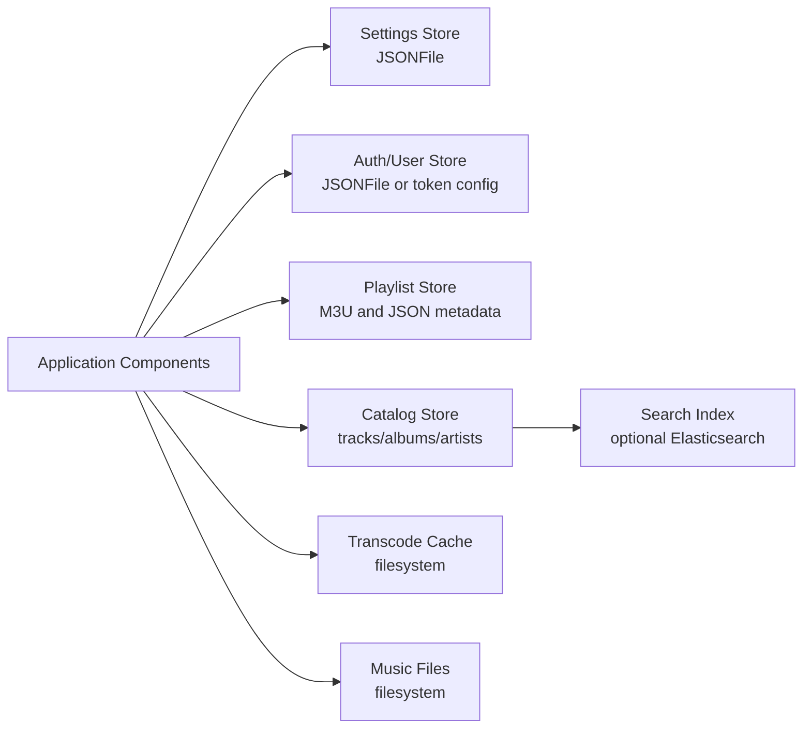
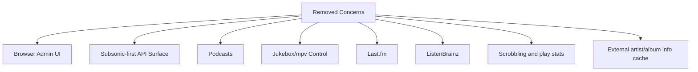

# Streaming Server Final State

This document captures the long-term target shape for the simplified API-only
streaming server. It is intentionally product-oriented: the goal is to show the
component boundaries clearly enough to decompose the work into a roadmap.

The target server is explicitly for playing music, playlist-driven playback, and
future live/continuous broadcast. It removes the browser admin UI, Subsonic-first
controller surface, podcasts, jukebox, Last.fm, ListenBrainz, and scrobbling.

## Final-State Overview

Open the SVG image directly for the high-level component map:



## Top-Level Components



## API Surface



## Playback Flow



## Broadcast Flow



## Storage Boundaries



## Removed From Final State



## Intended Package Direction

```text
cmd/gonic/
  main.go

api/
  openapi.yaml                 # eventual API contract

internal/
  pipeline/
  config/
  server/api/
  catalog/
  scanner/
  playlists/
  streaming/
  broadcast/
  transcode/
  storage/
    jsonfile/
    catalogindex/
  filesystem/
```

